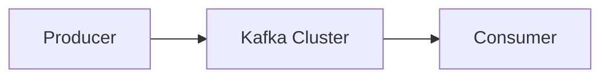
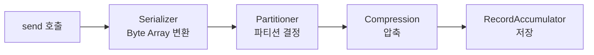
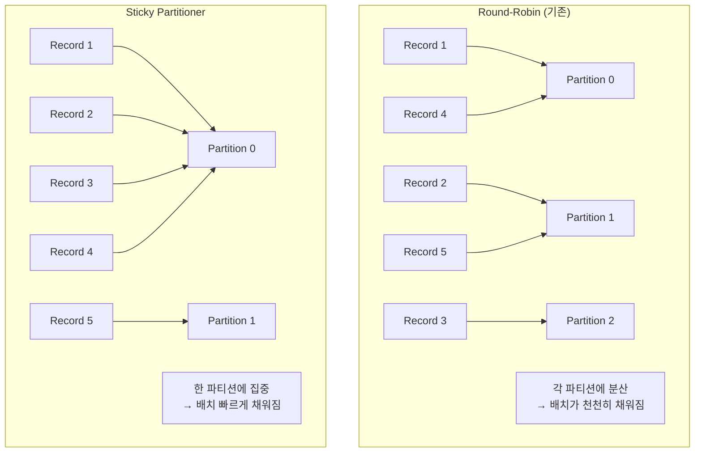
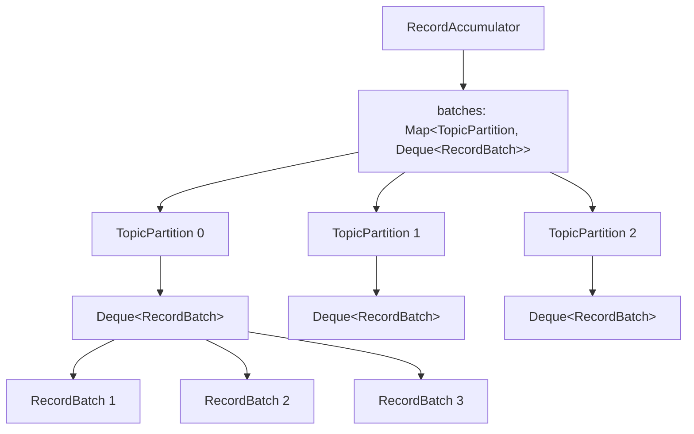
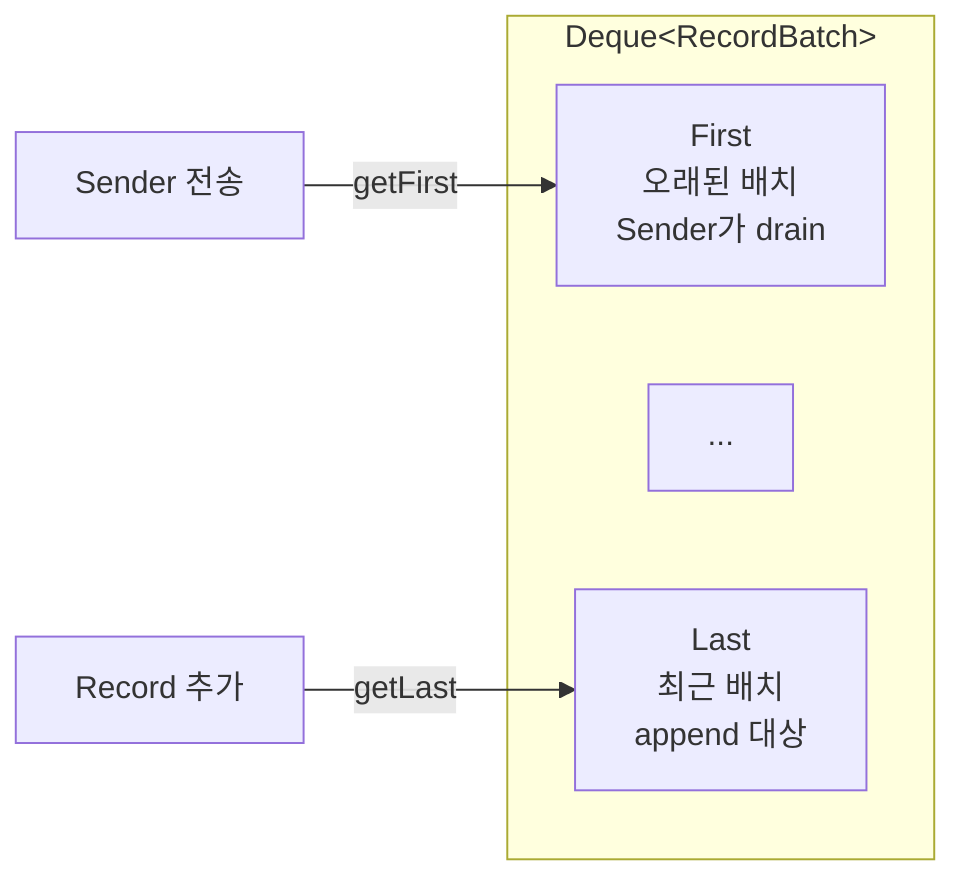
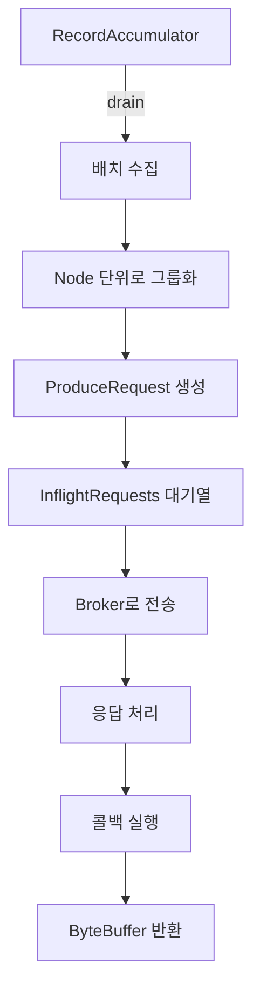

> Naver D2 의 내용을 기반으로 Producer 에 대해 정리한 내용.
> 2020년 작성된 내용이므로, 변화에 따른 내용도 포함되어 있다.

Kafka 는 Distributed Streaming Platform 으로, Produce - Consumer 가 연결되어 데이터가 전달된다.



## 기본 구성 요소

Kafka Producer 는 크게 3가지 요소로 구성된다.

```mermaid
graph TD
    KafkaProducer[KafkaProducer<br/>사용자가 send() 호출]
    RecordAccumulator[RecordAccumulator<br/>배치 단위로 저장]
    Sender[Sender Thread<br/>브로커로 전송 및 응답 처리]

    KafkaProducer --> RecordAccumulator
    RecordAccumulator --> Sender
    Sender --> Broker[Kafka Broker]
```

- KafkaProducer : 사용자가 직접 사용하는 요소. 클래스의 send 를 호출해서 Record 를 전송
- RecordAccumulator : Record 를 바로 전송하는게 아닌 해당 클래스에서 배치 단위로 저장
- Sender : 별도 Sender Thread 가 쌓인 Record 를 Broker 로 전송, 응답 받고 전송 시 설정한 콜백 있으면 실행

### KafkaProducer.send



send 가 호출되면, Serializer -> Partitioner -> Compression 작업이 이뤄지고
최종적으로 RecordAccumulator 에 Record 가 저장된다.

#### Serialization

Record 의 Key, Value 는 지정된 Serializer 에 의해 Byte Array 로 변환

```java
Properties props = new Properties();

props.put("key.serializer", "org.apache.kafka.common.serialization.StringSerializer");
props.put("value.serializer", "org.apache.kafka.common.serialization.StringSerializer");
```

```java
Producer<String, String> producer = new KafkaProducer<>(props, new StringSerializer(), new StringSerializer());
```

도 가능

ByteArray, ByteBuffer, Double, Integer, Long 등 Serializer 도 제공한다.

> Jackson 을 사용하면, JSON 직렬화도 가능

#### Partitioning

Kafka Topic 은 여러 개의 Partition 으로 나뉘어져 있다.
사용자 Record 는 지정된 Partitioner 에 의해 어떤 파티션으로 보내질지 정해진다.

Partitioner 를 지정하지 않으면, `org.apache.kafka.clients.producer.internals.DefaultPartitioner` 가 사용된다.

- key 가 있는 경우 : Hash 기반으로, 특정 파티션 고정
- key 가 없는 경우 : DefaultPartitioner 로 전략에 맞게 사용

- 예전에는 Round Robin 형식이였는데 문제점에 의해 개선을 했다고 한다.
  -> 배치 다 차기전에 `linger.ms` 가 끝나고, 텅 비거나 작은 박스를 보내게 되는 네트워크 오버헤드 발생
  (메시지가 각 파티션으로 흩어지다 보니, Batch 가 채워지는 속도가 느렸음)

이런 문제를 개선하기 위해 [Sticky Partitioner](https://www.confluent.io/blog/apache-kafka-producer-improvements-sticky-partitioner/?fbclid=IwAR1eDEFO-Q0j7vqu5hXJxoYjRTy6yryHbZrJ0cSUKXJn1NUzkX3NHRualWk) 의 방식으로 변경했다. - [참고 링크](https://dol9.tistory.com/277)

- Record 를 고르게 보내지 않고, 특정 Partition 이 다 찰때까지 Record Batch 를 꽉 채워서 보내게 동작
  -> 배치가 더 빨리 채워지고, 처리량은 늘어나고 지연 시간은 줄어든다



하지만, 그 다음에도 추가적인 문제가 존재했다.
Sticky Partitioner 로 인해 파티션 레코드 불균형이 심하게 일어날 수 있다.
브로커의 성능이 모두 동일하지 않을때 발생한다. - 파티션 Skews(쏠림)

- Sticky 방식은 특정 파티션의 배치가 전송 완료(ACK) 되어야 다음 파티션을 선택
- 특정 브로커의 네트워크가 느리거나, CPU 부하가 높으면 해당 브로커로 가는 배치 응답(ACK)이 늦어진다.

-> 응답이 늦어지는 동안, 해당 파티션에만 레코드를 쌓음 + 느린 브로커에 더 많은 데이터가 쌓이는 역설적 불균형 발생

이를 개선하기 위해 [Uniform Sticky Partitioning (Adaptive Partitioning)](https://cwiki.apache.org/confluence/display/KAFKA/KIP-794%3A+Strictly+Uniform+Sticky+Partitioner) 을 도입했다.

1. 각 파티션 별 '전송 중인 데이터량'과 '응답 속도' 를 계산
2. 응답이 느린 브로커 파티션은 선택될 확률을 낮추고, 응답이 빠른 브로커 파티션에 더 자주 붙인다. - Sticky 하게

-> 배치 효율을 유지하되, 특정 브로커에 데이터를 몰리는걸 방지
=> 전체 클러스터에 부하 균형

#### Compression

전송하려는 Record 를 압축해 네트워크 전송 비용도 줄이고, 저장 비용도 줄일 수 있다. (RecordAccumulator 에 저장될 때 바로 압축되어 저장)

- compression.type 을 설정하여 코덱을 지정할 수 있다(기본값은 none)
- gzip / snappy / lz4

### RecordAccumulator.append



사용자가 전송하는 Record 는 전송 전에 먼저 RecordAccumulator 에 저장된다.
batches 라는 Map 을 가지고 있는다. - Key 는 `TopicPartition`, Value 는 `Deque<RecordBatch>`

- 저장하기 전, Serialized Size 검사 - `max.request.size` or `buffer.memory` 설정값보다 크면 RecordTooLargeException 발생



추가될 Record 에 해당하는 TopicPartition 의 Deque 를 찾는다.
-> Deque 의 Last 에서 RecordBatch 를 하나 꺼내서 Record 저장할 공간 있는지 확인
-> 여유 공간이 있으면, 해당 RecordBatch 에 Record 를 추가, 없으면 새로운 RecordBatch 생성해서 Last 쪽으로 저장

- drain 은 deque 맨 앞에서 꺼내서 처리 - 오래된 요소부터 보내는게 당연
- append 시에는 가장 맨 뒤에서 꺼내서 처리 - 최근 생성된 RecordBatch 를 꺼내서 확인

- RecordBatch 생성 시, BufferPool 에서 RecordBatch 가 사용할 ByteBufer 를 받아온다. - `buffer.memory` 설정에 의해 결정
  -> Buffer Size 만큼 여유가 없으면 Allocation Blocking - `max.block.ms` 설정값만큼 기다림, 시간 초과할 시 TimeoutException

> BufferPool 을 사용하는 이유?
> Kafka 의 처리량을 극대화 하기 위해 메시지 보낼 때마다
> `ByteBuffer` 객체를 `new` 로 생성하고 버리면, GC 로 인해 서버 부하가 생긴다.
> => 미리 만들어두고, Buffer 를 재사용하는 방식으로 처리

- RecordBatch 생성 시 사용하는 Buffer Size 는 `batch.size` 설정값과 Record Size 중 큰 값으로 결정
  (`batch.size` 보다 작으면, 여러개의 Record 저장, Record 가 더 크면, 하나의 Record 만 저장)

### Sender Thread

Sender Thread 는 RecordAccumulator 에 저장된 Record 를 꺼내서 Broker 로 전송하고 응답 처리한다
(정확히는, 무한 루프에서 주기적으로 체크 구조 - 보낼 준비 된 배치가 있는지 확인, 있으면 가져오기)



RecordAccumulator 에서 Record 를 꺼냄 (drain 통해서 각 Broker 별 전송할 RecordBatch List 얻음)

1. 각 Broker Node 에 속하는 TopicPartition 목록 가져옴
2. TopicPartition 을 보면서 Deque First 쪽 RecordBatch 를 drain 하며 RecordBatch List 에 추가
3. Node 단위로 RecordBatch List 가 `max.request.size` 설정값을 넘지 않을 때까지 수집
4. 모아둔 배치 리스트를 하나의 ProduceRequest 로 만듬(실제 브로커 날아가는 데이터 패킷 단위)

    ```mermaid
    graph TD
        subgraph Batches["RecordBatch List"]
            B1[Partition 0 Batch]
            B2[Partition 1 Batch]
            B3[Partition 3 Batch]
            B4[Partition 5 Batch]
        end

        subgraph Node["Node 단위로 그룹화"]
            Broker1[Broker 1<br/>Partition 0, 1]
            Broker2[Broker 2<br/>Partition 3, 5]
        end

        B1 --> Broker1
        B2 --> Broker1
        B3 --> Broker2
        B4 --> Broker2

        Broker1 --> Request1[ProduceRequest 1]
        Broker2 --> Request2[ProduceRequest 2]

        Note[네트워크 효율:<br/>같은 브로커는 한 번에 전송]
    ```
    
    > 이 부분 꽤나 어렵다.
    > 데이터는 파티션별로 관리되지만, 전송은 브로커 단위로 묶어서 보낸다.
    > => 네트워크 효율성을 위해서
    
    하나의 브로커가 여러 파티션을 관리할 수 있다. (EX: 파티션 0, 파티션 1을 같은 브로커에서 관리)
    -> 두 배치를 하나의 패킷으로 묶어서 보내면, 통신이 한번만 발생한다.
    (TCP 커넥션 및 오버헤드 감소 + I/O 효율)

5. 순서 보장 및 흐름 제어를 위해 InflightRequests 라는 대기열을 먼저 거침

   - Deque 의 Size 는 `max.in.flight.requests.per.connection` 설정값으로 결정, 하나의 Broker 로 동시 전송할 수 있는 요청 수
   - 요청이 실패한 경우, retries 설정값이 1 이상인 경우 재시도 -> 이때, 위 설정값이 1보다 크면 순서가 바뀔수 있다⭐ - 2번째는 성공, 1번째는 실패
     (1로 설정하면, 순서를 보장할 수 있다. 하지만, 전송 성능은 떨어질 수 있다.)

    > 이 역시도 최신 Kafka Version 에서는 개선이 되었다!!
    
    `enable.idempotence=true` 이면, 시퀸스 번호를 검사하는 방식으로 한다.
    기존에 `Seq 0` 까지 저장되어 있다고 가정.

    네트워크 지연 때문에 요청 2(`Seq 2`) 보다 요청 1(`Seq 1`) 가 온다면?
    -> 순서가 안 맞기에 OutOfOrderSequenceException 을 반환한다.
    -> 프로듀서는 이에따라, 1번부터 다시 보낸다.
    => 여러개를 동시에 보내도, 데이터 순서가 꼬이지 않는다.

    ```mermaid
    sequenceDiagram
        participant Producer
        participant Broker

        Note over Broker: 현재 Seq: 0

        Producer->>Broker: Request 1 (Seq 1)
        Producer->>Broker: Request 2 (Seq 2)

        Note over Broker: 네트워크 지연으로<br/>Req 2가 먼저 도착

        Broker-->>Producer: OutOfOrderSequenceException<br/>(Seq 2 rejected, expected 1)

        Note over Producer: 순서 보정 필요

        Producer->>Broker: Request 1 (Seq 1) 재전송
        Broker-->>Producer: ACK (Seq 1)

        Producer->>Broker: Request 2 (Seq 2) 재전송
        Broker-->>Producer: ACK (Seq 2)

        Note over Broker: 순서 보장 완료
    ```

6. Sender Thread 는 Java NIO 의 Selector (IO Multiplexing) 방식 사용해 비동기적으로 여러 채널 전송 처리
7. Broker 는 Connection 에서 요청이 들어온 순서대로 처리해서 응답 - 순서 보장
8. 요청에 포함된, RecordBatch 콜백 실행 후, 응답을 Future 를 통해 사용자에게 전달
9. RecordBatch 에서 사용한 ByteBuffer 를 BufferPool 로 반환

를 통해 전송 처리 모두 마무리!
