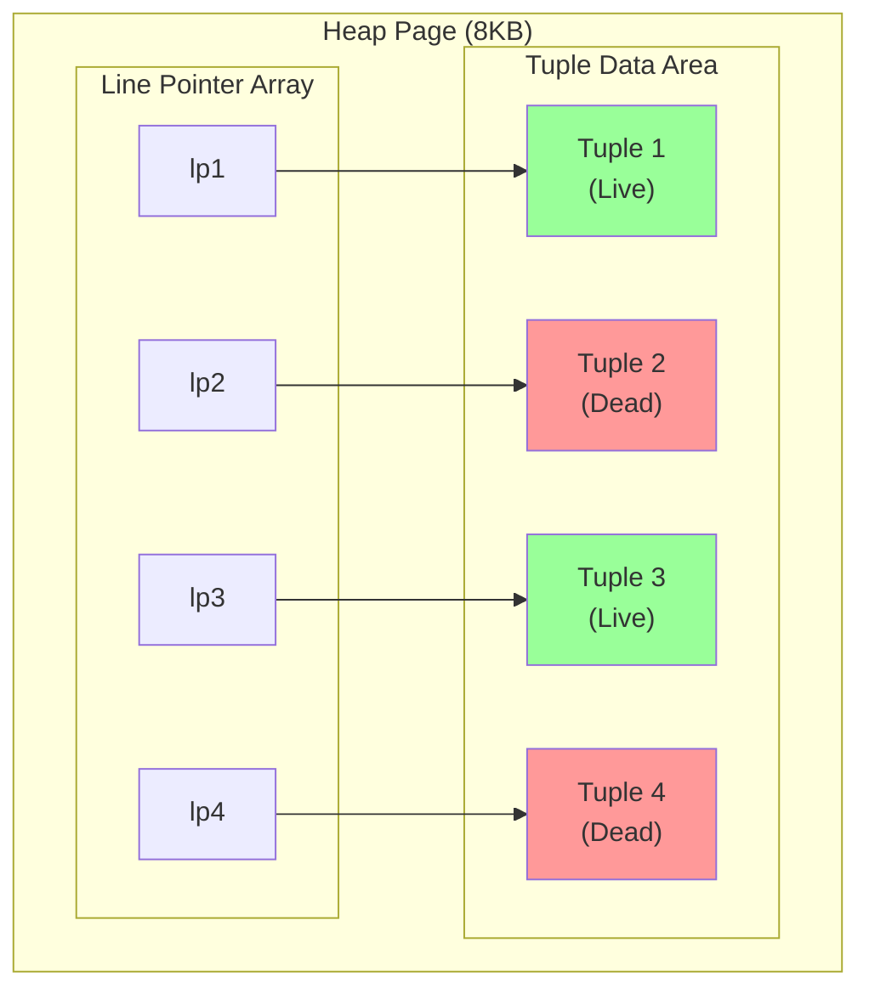
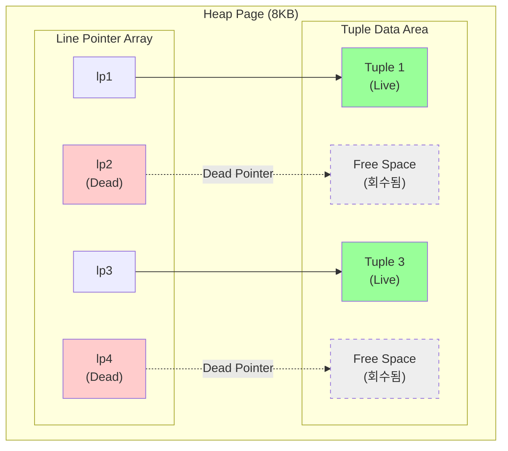

> 해당 내용은
> https://www.youtube.com/watch?v=lNLQDo-QcTg&list=PL4i1lIrXNArb_MUXFbdoCEO5_eWnPt3Fu
> Youtube 재생목록을 참고해서 추가적으로 내가 학습해나갔다. (Notebook LM 으로 PostgreSQL 내용을 정리해서 올린 재생목록)

## 스냅샷 데이터베이스의 비밀

스냅샷은 튜플들의 물리적 복사본이 아니다. (100GB DB 의 스냇샷을 뜨려면, 100GB 가 더 필요할 수도 있다)
-> 성능상 저하를 어마어마하게 불러올 것

스냅샷은 일종의 메타데이터이다.
`특정 데이터는 보이고, 특정 데이터는 안 보이게 할지` 판단하는 규칙만 저장한다. (사실상 생성 비용은 0)

스냅샷이 만들어질때 3가지를 포함한다.

- xmin : 실행 중인 트랜잭션에서 가장 오래된 번호
- xmax : 앞으로 할당예정인 가장 최신 번호,
- xip_list : xmin, xmax 사이 번호 중(`xmin \<= ID \<= xmax`), 아직 안 끝나고 실행중인 트랜잭션 ID 목록

xmin 보다 작은 데이터는 '무조건 끝난 과거'이므로 보여줘도 상관 없다.
xmax 보다 큰 데이터는 '발생하지 않은 미래'이므로 절대 보여주면 안된다.
xip_list 에 있는 요소는 '아직 작업중'이므로 보여주면 안된다.

### 실제 흐름

- xmin : 790
- xmax : 792
- xip_list : 790

| 트랜잭션 ID | 상태 | 가시성 | 이유 |
|------------|------|--------|------|
| 789 이하 | 완료됨 | ✅ 보임 | xmin(790)보다 작음 → 무조건 끝난 과거 |
| 790 | 실행 중 (미커밋) | ❌ 안 보임 | xip_list에 포함 → 아직 작업 중 |
| 791 | 커밋됨 | ✅ 보임 | xip_list에 없음 → 이미 완료됨 |
| 792 | 스냅샷 이후 시작 | ❌ 안 보임 | xmax(792) 이상 → 발생하지 않은 미래 |

790번 이전(789, 788...) 행은 보인다.
790번이 만든 데이터는 보이지 않는다. - 아직 `COMMIT` 을 하지 않았음
791번이 만든 데이터는 보인다. - 790번 보다는 늦게 시작했지만, `COMMIT` 이 되었음
792번이 만든 데이터는 보이지 않는다. - 스냅샷 뜬 이후의 트랜잭션

### Global xmin

Transaction Horizon, DB 내 모든 활성화된 트랜잭션 중 가장 오래된 xmin
-> VACUUM 이 오래된 행 버전을 안전하게 정리할 수 있게 해주는 경계선의 기준이 된다

만약, 하나의 트랜잭션이 엄청 오랫동안 유지가 된다면?
-> 과거 시점에 Horizon 이 멈춰있게 된다.
=> DB Bloating 이 발생!

> Bloating : 테이블, 인덱스가 제때 정리를 하지 못해 뚱뚱해짐

### 플레이북

1. 무조건 트랜잭션은 짧게, 필요한 일만하고 커밋
2. Idel In Transaction(`BEGIN`), Horizon 을 붙잡는 주범

`idle_in_transaction_session_timeout` 을 설정하면 좋다

3. `REPETABLE READ`, `SERIALIZABLE` 와 같은 높은 격리 수준은 트랜잭션은 하나의 스냅샷으로 끝까지 처리

`READ COMMITTED` 는 매 쿼리마다 스냅샷을 새로 찍는다.
트랜잭션이 길어도, xmin 이 갱신되어 VACUUM 처리를 한다.

4. DB 에 전체에 영향을 준다. - 테이블 하나에 한정이 아님! ⭐️⭐️

개발자가 만약에, 로그 테이블 (대용량 데이터) 에 조회하는 트랜잭션을 열어두고 퇴근한다면?
-> 주문 테이블도 청소를 하지 못한다. - global xmin 에 종속

#### pg_export_snapshot

추가로, 이런 스냅샷 구문을 통해 여러 프로세스가 정확히 동일 시점에 백업을 받을 수도 있다.
-> `pg_export_snapshot` 을 통해 스냅샷 기반 동일 데이터 보장

1. 대장 프로세스가 트랜잭션 시작하고 스냅샷 생성
2. 스냅샷 ID 를 서브 프로세스에게 할당
3. 서브 프로세스는 대장 프로세스 시점으로 고정해서 처리 - `SET TRANSACTION SNAPSHOT`
4. 서브 프로세스가 완벽히 동일한 시점의 데이터를 병렬로 백업

## 빠른 업데이트의 비밀

### 표준 업데이트의 프로세스

사실 PostgreSQL 에서의 UPDATE 는 UPDATE 가 아니다.

1. 오래된 행을 'dead' 로 표시
2. 완전 새로운 버전의 행을 다른 곳에 INSERT
3. 모든 단일 인덱스 새로운 행을 가르키도록 UPDATE

데이터의 물리적 위치(CTID)가 변경이 되었다.
바뀐게 없는 칼럼들도 모두 새로운 행을 가르키도록 UPDATE 를 해야한다..!
-> 상당히 비효율, 막대한 디스크 I/O, 인덱스 페이지에 죽은 포인터들이 쌓여 Bloating 발생

### Page Pruning

어떤 스냅샷에서도 볼 수 없는 튜플을 제거하는 단일 힙 페이지 정리작업

**Page Pruning 전:**

페이지 정리가 한번 돌면

**Page Pruning 후:**

dead 처리가 된다.
하지만, 문제가 존재한다.

- 페이지가 정리되어도, 인덱스는 죽은 데이터를 가르키고 있다
- 그렇기에, 인덱스를 새로 쓰는 작업을 해야만 한다

### Heap-Only Tuple

HOT UPDATE

인덱스는 건드리지 말고, 힙(데이터 페이지) 안에서 해결하는 방법

두 가지 조건이 필요하다.

1. 인덱스가 없는 칼럼을 수정 : 인덱스 키 값이 바뀌면, 어차피 인덱스 정렬 발생
2. 같은 페이지 내 빈 공간 : 다른 페이지로 이동해야 하면, HOT 가 불가능

Update Chain 의 방식으로 일어난다.

> 여기서 `Tuple 1`, `Tuple 2` 를 가리킨다고 적었는데
> 이 가르키는건 lp (Line Pointer) 를 의미한다. - 인덱스는 페이지 내부 어디에 데이터가 있는지는 모르고, 포인터만 알고 있음

- 인덱스가 `Tuple 1` 을 가르키고 있는데, `Tuple 1` 을 업데이트해서 `Tuple 2` 를 같은 페이지에 만들었다면?

- 일반적 방식 : 인덱스가 `Tuple 2` 를 직접 가르키게 수정
- HOT Update

1. 인덱스는 여전히 `Tuple 1` 을 가리킴 - 인덱스 수정 X
2. `Tuple 1` 헤더에 표시를 남긴다.(`HEAP_HOT_UPDATED`) - 최신 버전은 `Tuple 2` 라는걸 표시
3. PostgreSQL 엔진은 인덱스를 타고 `Tuple 1` 에 온 후, 표시를 보고 `Tuple 2` 로 페이지 내부에서 점프

### HOT Pruning

HOT 체인이 계속 길어지면, 결국 점프를 여러번 해야해서 느려질 것이다.
-> `SELECT` 쿼리 도중 틈틈이 가지치기를 수행해준다.

1. 죽은 튜플이 더이상 필요 없어지면(어떤 트랜잭션도 참조 X), 공간 회수
2. 리디렉션 수정 : `lp1` 이 `Tuple 1` 을 가르키는 걸 끊고, 바로 `lp2` 가르키게 만듬
3. 인덱스 타고 `lp1` 에 도착하면, `Tuple 1` 데이터를 거치지 않고, 바로 최신 데이터 `Tuple 2` 로 직행

=> lp1 이 lp2 로 가라고 안내를 해주는 형태로 변환 (즉, 실제 데이터에서 헤더를 보고 점프가 아님)

`VACUUM` 프로세스가 돌기 전, 일반 쿼리 도중에 가볍게 일어난다.

### Fill Factor

HOT 업데이트는 결국 '같은 페이지 내 빈 공간' 을 필요로 한다.
-> 이를 강제로 보장할 방법이 필요하다!

`Fill Factor` 를 설정하면 페이지 내 사용 공간을 설정한다. (기본값은 100)

EX) 70% 로 하면? 페이지 70% 만 채우고, 30% 는 비워둔다
-> 업데이트 발생하면, 비워둔 공간 30%에 새 버전을 넣는다. (HOT 성공)

자주 업데이트되는 테이블 + 인덱스가 걸려있지 않은 칼럼이 자주 바뀌는 테이블은 유용할 수 있다.
\<-> 한 번 쓰면 절대 안 바뀌는 로그성 테이블은 필요없다.
