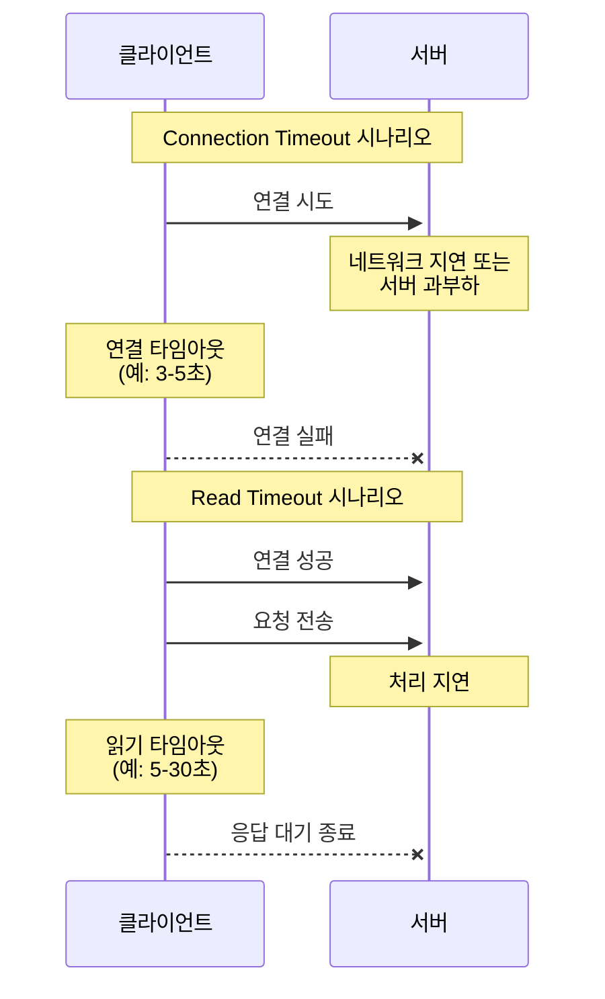
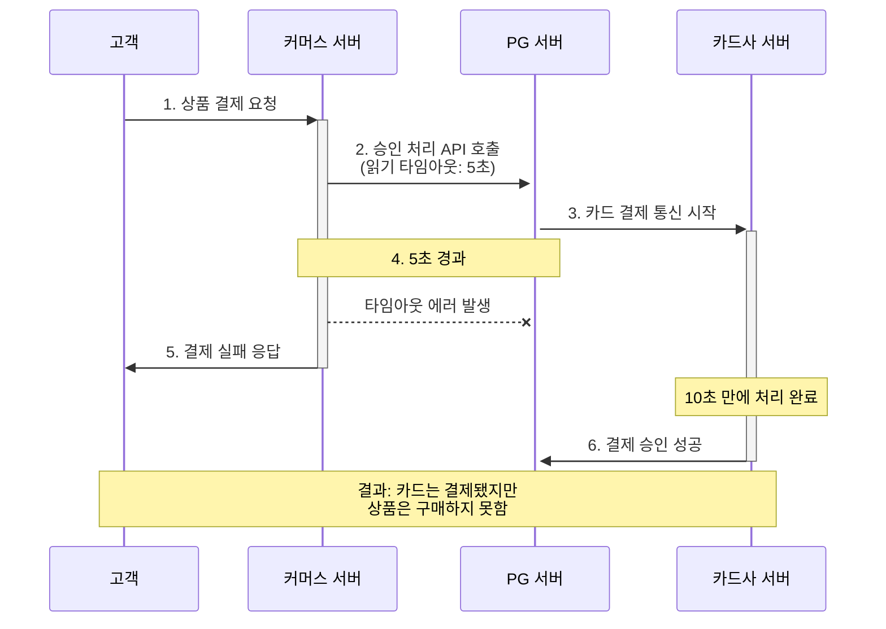

## 우리는 문제가 없다..?

외부 연동은 서버 개발에서 없어서는 안 될 요소가 되었다.
MSA 를 도입하는 기업이 늘며, 내부 서비스 간 연동도 복잡해지고, 비즈니스 로직상 외부 API 를 사용해야 하는 경우도 많아졌다.

연동에는 주의를 기울이지 않으면, 서비스가 심각한 장애를 겪을수도 있다.

EX) 새로운 서비스 오픈을 앞두고, 트래픽 처리에도 자신감이 있고 만반의 준비를 했다.
-> 하지만...? 오픈과 동시에 장애를 겪었다.
=> 정보 인증을 위해 외부 서비스를 호출했지만, 이 외부 서비스가 몰려드는 트래픽을 감당하지 못해 장애 발생

결국, 연동 서비스에 장애가 발생하면 우리 서비스도 영향을 받게된다.
연동 서비스 문제를 완전히 차단하기는 어렵짐나, 영향을 줄일 수는 있다.

## 타임아웃

외부 연동에서 가장 중요한 설정 중 하나
타임아웃을 적절히 설정하지 않으면, 연동 서비스에 장애 발생시 전체 서비스 품질이 급격히 나빠질 수 있다.
(타임아웃 시간만큼 딜레이)

- A 서비스는 톰캣 사용, 스레드 풀 크기는 200
- A 서비스는 B 서비스 호출
- B 서비스에 성능 문제 생겨, 응답 시간이 60초를 넘기기 시작

아무 요청이 없는 상태에서?

1. 사용자 100명이 동시에 A 서비스에 요청
2. 톰캣이 100개 요청을 처리, B 서비스 호출
3. 100개가 응답 기다리며, 모두 대기 상태
4. 10초 후, 또 다른 사용자 100명이 A 서비스에 요청
5. 1, 2, 3 반복

총 200개 요청이 동시 처리중이고, 모두 B 서비스 응답 대기중
또다시, 새로운 100명이 요청을 보내면??
-> 새로 들어온 요청은 처리 되지 않는다. A 서비스는 앞선 요청이 끝나야 새로운 요청이 처리 가능하다.

- 세 번째 100개 요청이 B 서비스 연동이 필요 없는 기능이라도 응답하지 못하게 된다.
- 사용자는 응답이 올 때까지 기다리지 않는다. 새로 고침을 해서 새로운 요청을 보낸다.

=> 연동 서비스에 대한 타임아웃 설정하지 않으면, 응답이 느리면 처리량이 급격히 떨어진다!!!

타임아웃을 설정한다면?

1. 사용자 100명이 동시에 A 서비스에 요청
2. 톰캣이 100개 요청을 처리, B 서비스 호출
3. 100개가 응답 기다리며, 모두 대기 상태
4. 10초 후, 또 다른 사용자 100명이 A 서비스에 요청

이때 톰캣이 처리 중인 요청은 없다.
앞선 100개 요청은 5초 안에 B 서비스로부터 응답을 받지 못해 `타임아웃 에러` 가 났기 때문이다.

- 사용자는 지정한 시간 뒤 에러 화면을 보게 된다.
  -> 반응 없는 무한 대기보다는 에러 화면보다 무조건 더 낫다.

- 사용자 요청에 대해 '스레드 풀' 자원이 포화되기 전 응답하므로, 다른 기능에 주는 영향을 줄일 수 있다.

### 연결 타임아웃, 읽기 타임아웃

>초당 30만 km (빛의 속도) 로 가도 지구 반대편에 도달하는데 0.067초가 걸린다.

- connection timeout

네트워크 상황, 연결할 서버의 상태에 따라 연결에 오랜 시간이 걸릴 수 있다.
-> 연결에 시간이 오래 걸리면, 대기 시간도 함께 증가한다.
=> 연결 타임아웃을 설정해 연결 대기 시간을 제한해야 한다.

- read timeout

연결이 되면, 요청을 전송하고 응답을 기다리게 된다.
-> 응답을 받기까지 시간이 오래 걸리면, 대기 시간도 함께 증가한다.

보편적인 기준이라면

- 연결 타임아웃 : 3초 ~ 5초
- 읽기 타임아웃 : 5초 ~ 30초

읽기 타임아웃은 꽤나 고려를 해야한다.

⭐ 타임아웃 시간이 너무 짧으면 연동 서비스가 정상 처리해도, 타임아웃 에러가 발생할 수 있다!!!

1. 고객이 상품 결제를 커머스 서버에 요청
2. `커머스 서버`는 승인 처리 위해 `PG 서버` API 호출 & 읽기 타임아웃 5초로 지정
3. `PG 서버`는 카드 결제 위해 카드사 시스템과 통신 시작
4. `커머스 서버`는 `PG 서버` 로부터 5초 내 응답을 받지 못해 타임아웃 에러 발생
5. 상품 결제 실패해, `커머스 서버` 는 고객에게 실패 응답 전송
6. `카드사 서버` 는 10초 만에 결제 승인에 성공하고, 그 결과 `PG 서버` 응답

이 과정대로라면....?
고객은 카드로는 결제했지만, 상품은 구매하지 못하는 불쾌한 상황에 빠진다.
(커머스 서버가 PG 서버와 타임아웃을 15초로 설정했다면 발생하지 않을 문제)

-> 결제와 같은 민감한 기능은 읽기 타임아웃 시간을 약간 길게 설정해 간혈적 연동 시간이 길어져도 정상적 처리

## 재시도

외부 연동에 실패했을때 처리 방법중 하나

네트워크 통신 과정에선 아래와 같은 경우가 있다.

- 간혈적으로 연결에 실패
- 일시적 응답 느려짐

### 재시도 가능 조건

재시도는 연동 실패를 줄이지만, 항상 재시도를 할 수 있는건 아니다.
-> 연동 API 를 다시 호출해도 되는 조건인지 확인해야 한다

재시도를 해도 되는 조건은 다음 3가지로 정리할 수 있다.

- 단순 조회 기능

단순 조회 기능은 재시도를 통해 성공 확률을 높일 수 있다.
-> 일시적 문제였다면, 다시 조회할 경우 `정상적 처리될 가능성`이 높다

- 연결 타임아웃

연결 타임아웃이 발생한 것은 연동 서비스에 아직 연결되지 않은 상태
-> 순간적 네트워크 문제면 재시도를 통해 `연결에 성공할 가능성`이 있다

- 멱등성 가진 변경 기능

상태를 변경하는 API 를 재시도할 때는 멱등성을 고려해야 한다.

> 멱등성 : 연산을 여러번 적용해도 결과가 달라지지 않는 성질

아래와 같은 로직이라면

- 좋아요 정보를 추가한다
- 콘텐츠 좋아요 수를 증가시킨다
- 200 상태 코드를 응답한다

이미 좋아요를 했다면, 아무 동작하지 않고 200 상태 코드를 응답한다.

- 좋아요를 여러번 눌러도 -> 좋아요는 한 번만 반영
- API 실행하는 동안 읽기 타임 발생해서 재시도 -> 데이터가 이상 상태를 가지지 않는다

추가로, 실패 원인에 따라 재시도 여부를 결정해야 한다.
검증단에서 오류가 발생하면, 재시도를 해도 동일하게 실패할 가능성이 높다

### 재시도 횟수와 간격

재시도는 2가지를 결정해야 한다.

- 재시도 횟수

재시도 횟수를 결정한다. 재시도를 무한정 할 수는 없다. (횟수만큼 응답 시간도 함께 증가)
-> 1~2번 정도의 재시도가 적당

- 재시도 간격

재시도 간격도 중요하다.
6초간 네트워크 연결 상태가 좋지 않은 상황을 가정해보면?

연결 타임아웃이 발생한 후, 바로 재시도하면 다시 연결 타임아웃이 발생할 수 있다.
-> 일정 간격을 두고, 재시도하면 일시적 네트워크 문제가 해소되며 성공할 가능성이 높아진다!

- 재시도 간격을 점진적으로 늘리는 것도 방법이다(backoff)

연동 서버에 가해지는 부하도 일부 완화할 수 있다.

### 재시도 폭풍 안티패턴

재시도는 성공 가능성을 높일 수 있지만, 연동 서비스에는 더 큰 부하를 줄 수 있다!

EX) 연동 서비스 성능이 느려져서 읽기 타임아웃이 발생한 상황이라면?

재시도를 하면, 연동 서비스는 같은 요청을 두 배로 받게 된다.
-> 성능이 느려진 상태에서 새로운 요청까지 더해지면 성능이 더 나빠진다.

=> 재시도를 검토할 때는 연동 서비스의 성능 상황도 함께 고려해야 한다. (서킷 브레이커)
